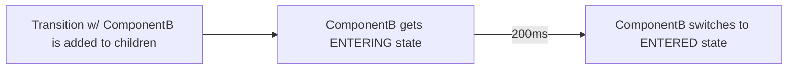
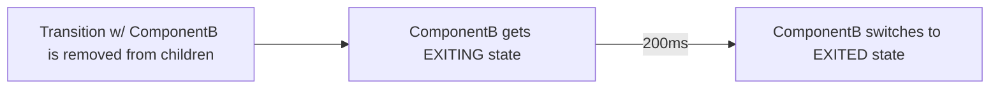

# Button Transitions

## react-transition-group: Transition Group, Transition

A Transition component allows us to wrap a component and render it with four separate states:

    ENTERING,
    ENTERED,
    EXITING,
    EXITED

We can use these states to control the styling of a component over time to create an animated affect.

On it's own, the **Transition** component determines these states when the "in" boolean prop changes, but when wrapped by a **Transition Group** component, these states change when the **Transition** component is added to **Transition Group's** children

    INITIAL:

    <TransitionGroup>
        <Transition key={key} timeout={200}>
            {state => (<ComponentA state={state} />)}
        </Transition>
    </TransitionGroup>

    New Transition Component added to children

    NEXT:
    <TransitionGroup>
        <Transition key={key} timeout={200}>
            {state => (<ComponentA state={state} />)}
        </Transition>
        <Transition key={key} timeout={200}>
            {state => (<ComponentB state={state} />)}
        </Transition>
    </TransitionGroup>

Similarly, when a child is removed, the component will be given the EXITING state, followed by EXITED.

    <TransitionGroup>
        <Transition key={key} timeout={200}>
            {state => (<ComponentA state={state} />)}
        </Transition>
        {/* Transiton w/ ComponentB removed  */}
    </TransitionGroup>

## Implementing in our Application

Since we want to animate changing from one **Button** component to another in the same place, we can render two different buttons on top of one another while the **opacity** _decreases_ for the initial Button and the **opacity** _increases_ for the incoming Button.

note: I should probably explain a few more things, and probably cut down the explanation on the react-transition-group components, I will finish this sometime before Monday morning
