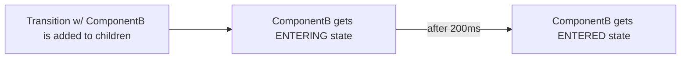

# Button Transitions

react-transition-group: Transition Group, Transition
@material-ui: makeStyles

Approach:

A Transition component allows us to wrap a component and render it in four separate states:

    ENTERING,
    ENTERED,
    EXITING,
    EXITED

We can use these states to control the styling of a component over time to create an animated affect.

On it's own, these states are determined by the Transition component's "in" boolean prop, but when wrapped by a Transition Group component, these states change when the Transition component is added to Transition Group's children

    INITIAL:
    <TransitionGroup>
        <Transition key={key} timeout={200}>
            {state => (<ComponentA state={state} />)}
        </Transition>
    </TransitionGroup>

    New Transition Component added to children

    NEXT:
    <TransitionGroup>
        <Transition key={key} timeout={200}>
            {state => (<ComponentA state={state} />)}
        </Transition>
        <Transition key={key} timeout={200}>
            {state => (<ComponentB state={state} />)}
        </Transition>
    </TransitionGroup>

Similarly, when a child is removed, the component will be given the EXITING state, followed by EXITED.
